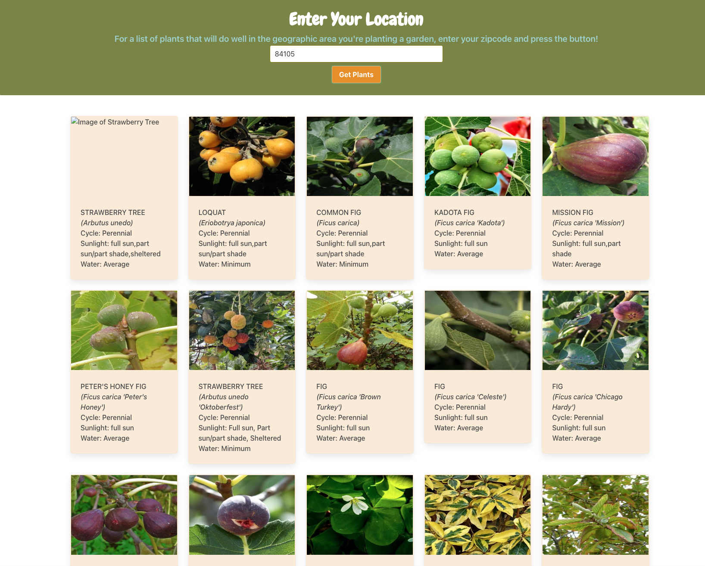

# 👩‍🌾 👨‍🌾 The Happy Gardener  🌱

With this web application, we were aiming to provide a resource for garden enthusiasts to easily find plants that can withstand and thrive in the particular geographic location of the garden.

## User Story 
As a gardener, it's helpful to be able to plant particular things that will grow well in the climate I live in. 

The United States Department of Agriculture classifies every geographic location with a particular "Hardiness Zone". The Hardiness Zones are determined based on the average annual extreme minimum winter temperature in a region, with each Hardiness Zone assigned to a number. 

From there, plants are categorized into which number hardiness zones they can thrive in. 

As a gardner, I want to ensure I am planting things that can survive in the hardiness zone that I live in.

In order to find a list of these plants, I want to be able to simply enter my zip code, and view a list of plants that correspond to the hardiness zone of my zip code. 

## Examples of Webpage 
On the homepage, the user is prompted with a text box where they can put their zip code in order to be shown a list of plants

Once they enter a zip code, they will get a list of plants based on their region, along with a bit of information about each plant including the sun needs, watering needs, and scientific name of the plant.

## Technical Application Information 

For this project we used two Server Side APIS

* [Plant Hardiness Zone API](https://rapidapi.com/fireside-worldwide-fireside-worldwide-default/api/plant-hardiness-zone/pricing)
    * This allowed us to convert zip codes into Hardiness Zones
* [Perenul](https://perenual.com/docs/api)
    * This allowed us to gather information on plants specific to the Hardiness Zone

We also used one CSS Framework

* [Bulma](https://bulma.io/)
    * This allowed us to give the page a layout without the need to write all the CSS on our own.

## Links
* [Deployed Link](https://nowakedj.github.io/happy-gardener/)
* [GitHub Repository Link](https://github.com/NowakEdJ/happy-gardener.git)

